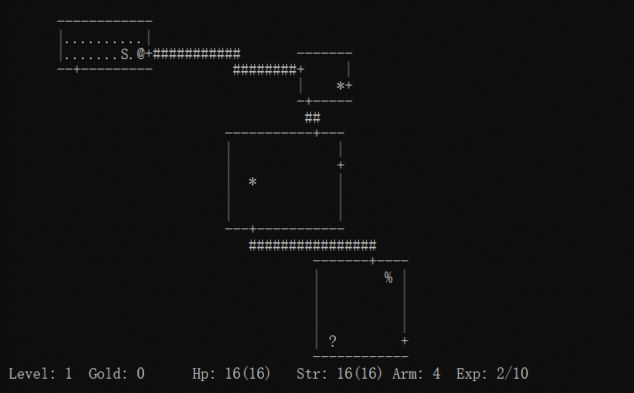

# What's it?

A fork of rogue-clone from Debian's [bsdgames-nonfree](https://packages.debian.org/bookworm/bsdgames-nonfree) package with bug fixes and enhancements. 

Most Linux distributions, such as Debian and Ubuntu, come with a text-based adventure game called "Rogue", which is an open-source reimplementation of the original Rogue game.

This fork starts from the source code of this Rogue implementation with several improvements.

## Changes

- Fixed an issue where the old version could produce a corrupted save file, potentially causing the program to crash during the loading process.
- Added support for Windows.
- Removed inode-ID and timestamp verification for save files, allowing some flexibility with backup and restore operations.
- Introduced a new wizard mode; press "CTRL+W" and enter "VAX" to enable it.
- Added a new wizard command "CTRL+G" to restore stamina and HP (requires wizard mode).
- One user can now have multiple entries on the ranking list.
- New `-u` argument can check the save file and decide open a new game or load the previous save file if exists.

## Must know

- Find the stairs and go down to the next level, locate the Amulet of Yendor, and bring it back safely.
- Use `?` command to view the list of available commands.
- When there is no way to go, use `s` command to search for nearby hidden passages. There are many secret doors and paths to discover.

## How to play?

- English: "[A guide to the dungeons of doom](doc/a-guide-to-the-dungeons-of-doom)".
- Chinese: 《[中文手册](doc/RogueChinese.md)》

## Build

requirements:

- libncurses for Linux
- pdcurses for Windows.

build:

